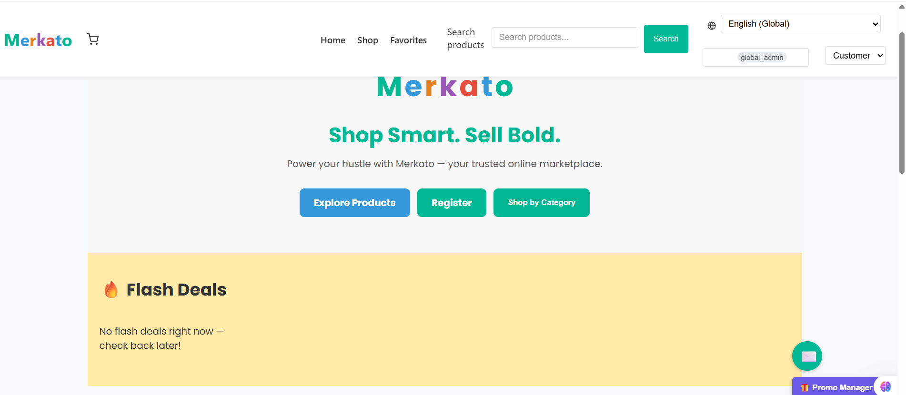

# Merkato Marketplace

Welcome to Merkato — a modern B2B and D2C commerce platform.


---

## Features

- Product management
- Customer & vendor dashboards
- Sales analytics
- Stripe payments
- Role-based access
- Multilingual support
- Automated testing (Jest, Cypress, GitHub Actions)
- MongoDB with Mongoose models
- Email invoices via Nodemailer
- PDF receipts & CSV exports

---

## Demo



> Merkato connects suppliers and buyers worldwide, delivering an AI-enhanced, scalable marketplace with multi-language support, dynamic monetization, and localized user experiences.

---

## Folder Structure

```
merkato/
  frontend/
  backend/
  .github/
  docs/
  .env.example
  README.md
  ...
```

---

## Getting Started

### 1. Clone and Install

```bash
git clone https://github.com/asetolessa711/merkato.git
cd merkato
npm install
cd frontend && npm install
cd ../backend && npm install
```

### 2. Environment Variables

Copy `.env.example` to `.env`, `.env.test`, and `.env.local` as needed. Then fill in secrets:

```env
MONGO_URI=mongodb://localhost:27017/merkato
JWT_SECRET=your_jwt_secret
STRIPE_SECRET_KEY=sk_test_xxx
STRIPE_PUBLISHABLE_KEY=pk_test_xxx
STRIPE_WEBHOOK_SECRET=whsec_xxx
```

> Tip: Never commit real secrets or credentials. `.gitignore` already protects `.env*` files.

### 3. Run in Dev Mode

```bash
# In one terminal
cd backend
npm run dev

# In another terminal
cd frontend
npm run dev
```

---

## Testing

### Backend (Jest)
```bash
cd backend
npm run test
```

### Frontend (React Testing Library)
```bash
cd frontend
npm test
```

### E2E (Cypress)
Recommended commands:
```bash
# Fast Windows headless with ephemeral DB
cd frontend && npm run e2e:fast:win

# Attach to running dev servers
cd frontend && npm run e2e:attach:core

# Full deterministic (build-and-serve)
cd frontend && npm run e2e:run
```

Seeding:
```bash
cd backend
npm run seed:test
```

### E2E Strategy (Attach vs Build-and-Serve)

We support two primary modes:

- Attach Mode (local dev): run backend and frontend dev servers, then run Cypress against them (fastest iteration).
- Build-and-Serve (beta/CI): the E2E runner starts backend, seeds DB, builds the frontend, serves static assets, and runs Cypress (deterministic).

Optional: set `E2E_EPHEMERAL=true` so each run uses a unique Mongo database (clean state, no cross-run drift). See `docs/E2E_STRATEGY.md` for details and commands.

### E2E Commands
Common workflows are documented in `docs/E2E_COMMANDS.md`:
- Attach Mode against running servers
- Semi‑Attach (runner starts backend with ephemeral DB; reuse dev frontend)
- Build‑and‑Serve (CI/Beta) with optional ephemeral DB and auto‑drop

---

## CI/CD (GitHub Actions)

Automated test pipelines:

- Backend Tests — `backend-tests.yml`
- Frontend Tests — `frontend-tests.yml`
- E2E Cypress Tests — `e2e-cypress.yml`

Features:
- DB seeding with `cy.task('db:seed')`
- Parallel Cypress execution
- Screenshots/videos as artifacts
- Runs on pushes/PRs to `main` or `dev`

---

## Documentation

- See `docs/testing-system.md` for test architecture & coverage.
- Use `docs/` for additional architecture, API, and usage docs.

---

## Customer Strategy

Merkato treats every buyer as a customer from first touch. Identity is unified; rewards scale with behavior. Purchase is never gated by role.

Core Principles
- Minimal Segmentation: Everyone gets access to deals — no gated tiers.
- Behavior-Triggered Rewards: Actions like sharing, buying, or returning unlock instant perks.
- Gamified UX: Surprise discounts, spin-to-win, and daily check-ins drive habit loops.
- Social Commerce: Group buying and referrals are central to growth.

Suggested Tiers

Segment | Behavior Trigger | UX Treatment | Reward Logic
--------|-------------------|--------------|--------------
Visitor | First-time or passive browsing | Surprise deal, spin-to-win, onboarding | Welcome discount, free shipping
Active Shopper | Purchase or cart activity | Fast checkout, personalized feed | Instant coupon, loyalty points
Sharer | Referral, group buy, or social share | Social storefront, invite dashboard | Referral bonus, group discount

Implementation Notes
- Unified Identity: Orders can be placed by signed-in users or visitors; visitors provide minimal buyerInfo (name, email, country). Backend upserts a minimal customer and ties the order.
- Behavior Capture: `BehaviorEvent` stores share/referral/group events for tiering.
- Profile Summary API: `GET /api/customer/profile-summary` returns segment, rewardsEligible, and progressive flags (onboardingNeeded, fastCheckoutEligible).
- Rewards are applied progressively in UX; purchase access is never blocked by tier.

### Checkout Requirements
- buyerInfo (for unauthenticated buyers):
  - Required: `name`, `email`, `country`
  - Optional: `phone`
- shippingAddress: Required for all orders (supports multiple addresses per buyer)
  - Required: `fullName`, `city`, `country`
  - Optional: `phone`, `street`, `postalCode`
  - Can differ from buyerInfo (e.g., sending gifts)
- payment:
  - `paymentMethod` required. Platform accepts all legal payment methods (cards, mobile wallets, PayPal/local gateways).
  - When using card methods (e.g., Stripe/Chapa), provide `paymentIntentId`/`cardToken`.

---

## Contributing

Pull requests are welcome.
Please lint and test before submitting. Install pre-commit hooks to automatically run tests before commits:
```powershell
pwsh -File ./scripts/install-git-hooks.ps1
```
This installs POSIX and Windows hooks and helps prevent committing empty/temp files.
For major changes, open an issue first to discuss the proposal.

---

## License

MIT

---

## Quick Test Commands

```bash
npm run test               # Backend
cd frontend && npm test    # Frontend
cd frontend && npx cypress open  # E2E GUI
```
