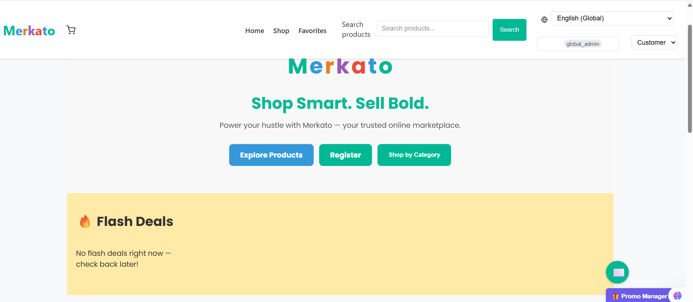

# Merkato Marketplace
Welcome to Merkato — a modern B2B and D2C commerce platform.


---

---

### Accessibility (A11y)

- Local a11y smoke (critical-only):
  - From `frontend/` on Windows PowerShell: `npm run e2e:a11y`
  - Artifacts are written to `frontend/cypress-results/a11y-summary.json` and timestamped under `frontend/test-report/`.
- PR Gate: A dedicated workflow runs the a11y smoke on pull requests to `main`/`dev` and fails on critical violations.

### PR E2E Smoke Gate: Label-driven scope

- Default scope includes `@smoke` and excludes `@flaky`.
- You can tune scope by adding PR labels (case-insensitive):
  - Include tags: `e2e-include-admin`, `e2e-include-vendor`, `e2e-include-buyer`, `e2e-include-a11y`, `e2e-include-negative`
  - Include flows: `e2e-include-checkout`, `e2e-include-auth`, `e2e-include-refund`
  - Exclude: `e2e-exclude-slow`, `e2e-exclude-payments`
- The workflow comments back the computed tag include/exclude for traceability.
- Artifacts include a scope report at `frontend/scope-report.{json,txt}` and under `frontend/test-report/<timestamp>/`.

## Features

- Product management
- Customer & vendor dashboards
- Sales analytics
- Stripe payments
- Role-based access
- Multilingual support
- Automated testing (Jest, Cypress, GitHub Actions)
- MongoDB with Mongoose models
- Email invoices via Nodemailer
- PDF receipts & CSV exports

---

## Demo



> Merkato connects suppliers and buyers worldwide, delivering an AI-enhanced, scalable marketplace with multi-language support, dynamic monetization, and localized user experiences.

---

## Folder Structure

```
merkato/
  frontend/
  backend/
  .github/
  docs/
  .env.example
  README.md
  ...
```

---

## Getting Started

### 1. Clone and Install

```bash
git clone https://github.com/asetolessa711/merkato.git
cd merkato
npm install
cd frontend && npm install
cd ../backend && npm install
```

### 2. Environment Variables

Copy `.env.example` to `.env`, `.env.test`, and `.env.local` as needed. Then fill in secrets:

```env
MONGO_URI=mongodb://127.0.0.1:27017/merkato-dev
MONGO_URI_DEV=mongodb://127.0.0.1:27017/merkato-dev
MONGO_URI_TEST=mongodb://127.0.0.1:27017/merkato_test
MONGO_URI_E2E=mongodb://127.0.0.1:27017/merkato_e2e
JWT_SECRET=your_jwt_secret
STRIPE_SECRET_KEY=sk_test_xxx
STRIPE_PUBLISHABLE_KEY=pk_test_xxx
STRIPE_WEBHOOK_SECRET=whsec_xxx
```

> Tip: Never commit real secrets or credentials. `.gitignore` already protects `.env*` files.

### 3. Run in Dev Mode

```bash
# Canonical (from repo root)
npm run dev

# Alternative (two terminals)
cd backend && npm run dev
cd frontend && npm run dev
```

### Codespaces-First Setup (Mongo Runs in Codespaces)

This repository includes a devcontainer setup where MongoDB runs as a service inside Codespaces.

- Canonical DB names:
  - `merkato-dev`
  - `merkato_test`
  - `merkato_e2e`
- Canonical URIs are auto-wired in `.devcontainer/devcontainer.json`.
- Fresh Codespaces run repository-driven bootstrap automatically via `.devcontainer/postCreate.sh`.

Manual bootstrap/rebuild commands:

```bash
npm run db:bootstrap:dev
npm run db:bootstrap:test
npm run db:bootstrap:e2e

npm run db:validate:dev
npm run db:validate:test
npm run db:validate:e2e
```

Detailed guide: `docs/CODESPACES_DATABASE_SETUP.md`.

### 4. Core Verification (before PR/merge)

Run the standard checks from the repo root:

```bash
npm run guard:focused
npm run guard:lint
npm run verify:core
```

Optional visibility scan for duplicate basenames (non-blocking):

```bash
npm run guard:duplicates
```

---

## Testing

### Backend (Jest)
```bash
cd backend
npm run test
```

### Frontend (React Testing Library)
```bash
cd frontend
npm test
```

### E2E (Cypress)
```bash
cd frontend
npx cypress open  # or: npx cypress run
```

Seeding:
```bash
cd backend
npm run seed:test
```

### E2E Strategy (Attach vs Build-and-Serve)

We support two primary modes:

- Attach Mode (local dev): run backend and frontend dev servers, then run Cypress against them (fastest iteration).
- Build-and-Serve (beta/CI): the E2E runner starts backend, seeds DB, builds the frontend, serves static assets, and runs Cypress (deterministic).

Optional: set `E2E_EPHEMERAL=true` so each run uses a unique Mongo database (clean state, no cross-run drift). See `docs/E2E_STRATEGY.md` for details and commands.

### Frontend Coverage (Tiered Strategy)

Current Tier: 2 (unit + key integration flows: ShopPage, VendorOrders, CustomerOrders)

Latest Metrics (post Tier 2 uplift):

| Metric | Percent |
|--------|---------|
| Lines  | ~34%    |
| Statements | ~33% |
| Functions | ~27% |
| Branches | ~27%  |

Enforced Minimum Thresholds (ratchet baseline):

| Metric | Min |
|--------|-----|
| Lines  | 32  |
| Statements | 32 |
| Functions | 25 |
| Branches | 25 |

Thresholds sit a few points below current to avoid churn; they will be raised incrementally as Tier 3 expands scenario and edge coverage.

Run locally:

```bash
cd frontend
npm run test:coverage
npm run coverage:summary
```

Compact JSON summary: `frontend/coverage/coverage-compact.json` (used in PR comments workflow).

### E2E Commands
Common workflows are documented in `docs/E2E_COMMANDS.md`:
- Attach Mode against running servers
- Semi‑Attach (runner starts backend with ephemeral DB; reuse dev frontend)
- Build‑and‑Serve (CI/Beta) with optional ephemeral DB and auto‑drop

---

## CI/CD (GitHub Actions)

Automated test pipelines:

- Backend Tests — `backend-tests.yml`
- Frontend Tests — `frontend-tests.yml`
- E2E Cypress Tests — `e2e-cypress.yml`

Features:
- DB seeding with `cy.task('db:seed')`
- Parallel Cypress execution
- Screenshots/videos as artifacts
- Runs on pushes/PRs to `main` or `dev`

---

## Documentation

- See `docs/testing-system.md` for test architecture & coverage.
- Use `docs/` for additional architecture, API, and usage docs.

### MicroBanner (Promo/Trust bar)

The slim bar displayed above the navbar rotates promotional and trust messages. It is enabled across all layouts (public, customer, vendor, admin).

- Admin pages
  - Manage promos: `/admin/microbanner`
  - Manage trust messages: `/admin/trust-ticker`
- Storage keys (local, auto-broadcast to open tabs)
  - Promos: `merkato-microbanners`
  - Trust: `merkato-trust-messages`
- Promo item fields (per row)
  - `text` (required)
  - `type`: `promo` | `info` | `cultural`
  - `action`: `link` | `modal`
    - When `link`: `href` supports internal paths (e.g., `/shop?sort=new`) or full URLs
    - When `modal`: `modalTitle`, `modalBody`
  - `cta`: optional inline button label (e.g., "Shop now")
  - `bg`, `fg`: optional CSS color overrides (hex or CSS variables like `var(--microbanner-bg)`)
  - `startAt`, `endAt`: optional ISO date/time window (inclusive)
  - `enabled`: boolean
- Trust messages
  - Managed separately in `/admin/trust-ticker`. These interleave 1:1 with promos by default. Set mode to off with localStorage key `trust-ticker-mode = off` if needed.
- Theming (CSS variables in `frontend/src/styles/tokens.css`)
  - `--microbanner-bg` / `--microbanner-fg` (promo default)
  - `--microbanner-bg-info` / `--microbanner-fg-info`
  - `--microbanner-bg-cultural` / `--microbanner-fg-cultural`
  - `--microbanner-bg-trust` / `--microbanner-fg-trust`
  - Navbar background is a deep navy: `--nav-bg: #0F1424`

Contrast tips
- Prefer dark foregrounds on light translucent backgrounds (defaults already tuned). If overriding, verify WCAG contrast (~AA) for small text.
- Use `var(--ink)` for dark text and `var(--success)` for trust highlights.

---

## Customer Strategy

Merkato treats every buyer as a customer from first touch. Identity is unified; rewards scale with behavior. Purchase is never gated by role.

Core Principles
- Minimal Segmentation: Everyone gets access to deals — no gated tiers.
- Behavior-Triggered Rewards: Actions like sharing, buying, or returning unlock instant perks.
- Gamified UX: Surprise discounts, spin-to-win, and daily check-ins drive habit loops.
- Social Commerce: Group buying and referrals are central to growth.

Suggested Tiers

Segment | Behavior Trigger | UX Treatment | Reward Logic
--------|-------------------|--------------|--------------
Visitor | First-time or passive browsing | Surprise deal, spin-to-win, onboarding | Welcome discount, free shipping
Active Shopper | Purchase or cart activity | Fast checkout, personalized feed | Instant coupon, loyalty points
Sharer | Referral, group buy, or social share | Social storefront, invite dashboard | Referral bonus, group discount

Implementation Notes
- Unified Identity: Orders can be placed by signed-in users or visitors; visitors provide minimal buyerInfo (name, email, country). Backend upserts a minimal customer and ties the order.
- Behavior Capture: `BehaviorEvent` stores share/referral/group events for tiering.
- Profile Summary API: `GET /api/customer/profile-summary` returns segment, rewardsEligible, and progressive flags (onboardingNeeded, fastCheckoutEligible).
- Rewards are applied progressively in UX; purchase access is never blocked by tier.

### Checkout Requirements
- buyerInfo (for unauthenticated buyers):
  - Required: `name`, `email`, `country`
  - Optional: `phone`
- shippingAddress: Required for all orders (supports multiple addresses per buyer)
  - Required: `fullName`, `city`, `country`
  - Optional: `phone`, `street`, `postalCode`
  - Can differ from buyerInfo (e.g., sending gifts)
- payment:
  - `paymentMethod` required. Platform accepts all legal payment methods (cards, mobile wallets, PayPal/local gateways).
  - When using card methods (e.g., Stripe/Chapa), provide `paymentIntentId`/`cardToken`.

---

## Contributing

Pull requests are welcome.
Please lint and test before submitting.
For major changes, open an issue first to discuss the proposal.

---

## License

MIT

---

## Quick Test Commands

```bash
npm run test               # Backend
cd frontend && npm test    # Frontend
cd frontend && npx cypress open  # E2E GUI
```
